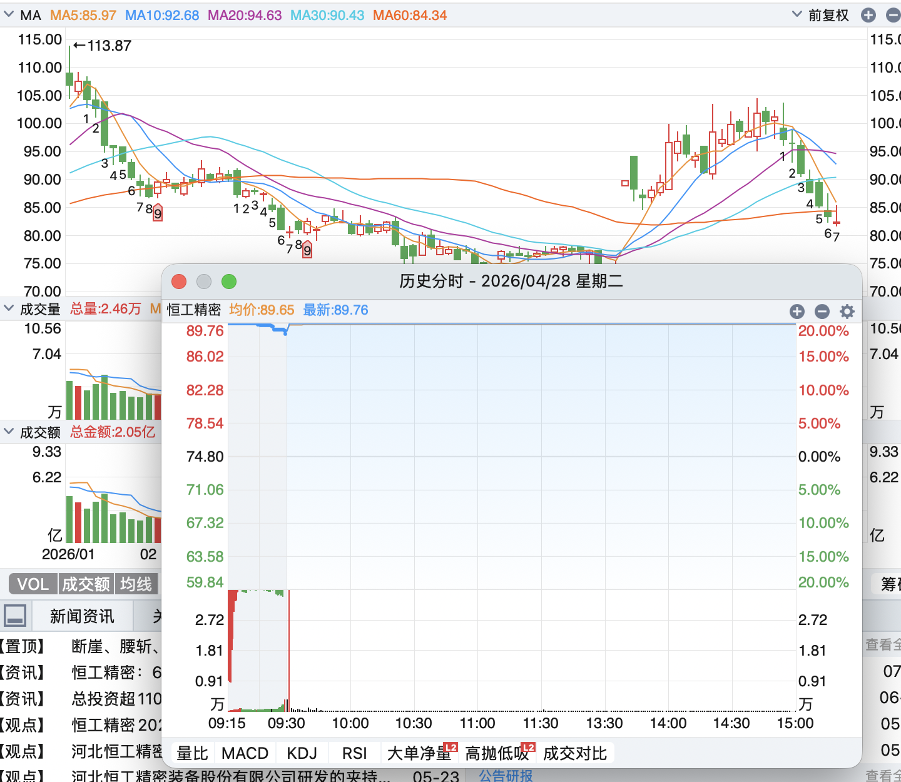

# 赛题一 — 赛题与数据

**AFAC2026 挑战组 — 赛题一：市场参与者交易行为识别与资金流向分析**

> **来源：** 天池【赛题与数据】页面，由网页复制粘贴后整理。  
> **English:** [`topic-specifications-and-data.en.md`](./topic-specifications-and-data.en.md)  
> **特征表：** [`reference-feature-set.md`](./reference-feature-set.md)（89 个字段）

---

## 一、任务介绍

市场参与者（公募基金、量化私募、游资等）的大额买卖对股价影响显著，资金流向是重要风向标。普通投资者面对 Level-2、龙虎榜或简单净流入/流出指标时存在两大痛点：

1. **信息碎片化** — 单指标难以还原建仓、拉抬或出货意图；机构常通过拆单、对倒隐藏动作
2. **解读滞后性** — 多数指标基于日线，无法捕捉盘中动态

本赛题要求构建**市场参与者交易行为识别与资金流向分析**体系：结合逐笔成交、订单簿微观结构、基本面等，从高频数据中解析参与者行为与资金流向，识别资金属性（游资/量化/散户等）、意图（吸筹、试盘、对倒、拉升、出货等），输出清晰易懂的分析结论。

---

## 二、任务目标

基于 A 股**逐笔委托、逐笔成交、逐笔撤单、十档盘口快照**（可通过淘宝、闲鱼、百度网盘等自行获取），构建完整方法论，对**游资/量化**两类机构精细区分，识别买卖方向与意图。技术手段不限，鼓励大模型与经典量化结合。

**游资/量化全天交易汇总输出：**

1. 主导参与者类型及置信度
2. 买/卖/中性方向意图及置信度

> **标签说明：** 目标描述使用「中性」，示例与 Baseline 使用 **`T0交易`**。提交 CSV 须用中文：`游资`、`量化机构`、`买入`、`卖出`、`T0交易`。

---

## 三、任务数据

参赛者自行获取 Level-2 数据。组委会提供**参考特征集**字段列表（见 [`reference-feature-set.md`](./reference-feature-set.md)），选手可据此设计模型。

### 3.1 参考特征集

89 个字段，分属 rs / cb / oss / ap / obp / pd / pi 等族。**不以可下载表格形式提供** — 须从原始 L2 计算。

---

## 四、数据集构成

### 4.1 数据样例

于赛题详情页顶部下载（本仓库见 `samples/`）。

### 4.2 数据分布（初赛）

| 数据集 | 股票数 | 时间段 |
|--------|--------|--------|
| 样例集 1 | 20 | 2026/05/07 |
| 测试 A 集 | 100 | 2026/06/08 — 2026/07/10 |
| 测试 B 集 | 100 | 2026/07/13 — 2026/07/24 |

---

## 五、任务规则及提交说明

### 5.1 数据说明

- **T 日**提交的方案，在**未来 3 个交易日**进行市场真实环境检验，预计 **T+5 日前后**公布排名
- 同一时间仅**最新方案**参与评估；多次更新按**时序跟踪效果**综合评分（移动加权平均）
- 允许使用**盘后非实时信息**（新闻、自媒体）事后验证与修正建模，但**最终预测须基于盘中高频数据**

#### A 榜

| 规则 | 说明 |
|------|------|
| 时间 | 2026/06/09 — 2026/07/10 |
| 数据 | 同期市场真实交易数据 |
| 提交 | 每天最多 **3 次**；仅以**最后一次**计分（如 17:00、18:00、19:00 → 取 19:00） |
| 截止 | 交易日 **23:59 前**提交，过期当天得 **0 分** |
| 最终截止 | **7 月 10 日（周五）23:59**；A 榜成绩 **7 月 13 日**公布 |
| 评分 | 移动加权平均 |

> **运营说明：** 平台 FAQ 补充 **18:00 更新答案 → 次日 08:00 前**上传昨日预测可得即时分（见 [`../official_guidance/官方答疑与提交说明.md`](../official_guidance/官方答疑与提交说明.md)）。

**进入 B 榜：** 须在 A 榜取得**有效成绩**（中文原文特有说明）。

#### B 榜

| 规则 | 说明 |
|------|------|
| 时间 | 2026/07/13 — 2026/07/24 |
| 提交 | 每个交易日**必须提交一次** |
| 最低天数 | **不满 8 个交易日 → 不计入最终排名** |
| 评分 | 同 A 榜，T+5 移动加权平均 |
| 公布 | 拟 **2026/07/28** |
| 审核 | **TOP15** 结果复现审核，决定决赛路演资格 |

### 5.2 答题要求

**Task 1 — 交易模式识别**

- 基于数据特征聚类不同交易模式
- 评估：类间区分度 + 类内聚合度
- 距离：**Wasserstein + DTW**

**Task 2 — 交易模式归类及资金类型识别**

- 输出**两类参与者**识别结果
- 评估：**加权 F1**

### 5.3 A/B 榜评分方法

```
总得分 = 交易模式识别分 × 0.4 + 参与者识别分 × 0.6
```

基于股票市场最新真实交易数据。参与者识别分、方向意图识别分、行情阶段识别分均采用 F1（精确率 P = TP/(TP+FP)，召回率 R = TP/(TP+FN)，F1 = 2PR/(P+R)）。

> 「行情阶段识别分」与提交的两个 CSV 关系见 [`README.md`](./README.md) 交叉引用说明。

### 5.4 提交文件

#### A 榜

每日 `submit.zip`（`pattern_reco.csv` + `predict_result.csv`），最晚 **7 月 10 日 23:59**。

**`pattern_reco.csv`** — 4 列，勿改字段名与顺序：

| stock_code | transaction_date | pattern_type | pattern_explanation |
|------------|------------------|--------------|---------------------|
| stock1 | 20260710 | 大单吸筹 | 资金大笔挂单买入 |
| stock2 | 20260615 | 日内套利 | 在一定价格区间高抛低吸 |
| stockN | 20260715 | 尾盘突袭 | 下午 2 点半后集中拉升/砸盘 |

**`predict_result.csv`** — 4 列：

| stock_code | transaction_date | capital_type | capital_intention |
|------------|------------------|--------------|-------------------|
| stock1 | 20260710 | 游资 | 买入 |
| stock2 | 20260615 | 游资 | 卖出 |
| stockN | 20260715 | 量化机构 | T0交易 |

#### B 榜

格式与 A 榜相同，**每天必须提交两个文件**。

#### 报告阶段（B 榜 TOP15）

**7 月 28 日 — 8 月 5 日**提交 `project_solution_report.docx` + `project_solution.zip`。

### 5.5 代码审核

B 榜前 15 名提交完整 Python 代码；依赖写在 `init_env.sh`；入口 `main.py` 输出 `predict_result.csv`；严禁硬编码；须基于收盘前盘中数据产出；相对路径；全链路复现验证。

---

## 六、入围规则

B 榜前 15 名由组委会通知提交材料；违规或未提交取消资格，按天池榜单递补。

---

## 七、任务样例

以下股票代码为示意，提交时使用样例集真实代码。

### 7.1 总体思路

从逐笔委托、成交、撤单、盘口快照四类原始数据出发，综合运用统计、特征工程、机器学习或规则推理，刻画每只股票每个交易日的盘面行为。技术路线不限。

### 7.2 案例一：某精密制造股的「缩量博弈」

> **项目 brief 引用的官方锚点（赛题 spec §7.2）。**



*天池赛题页截图（恒工精密分时，2026-04-28）。配图与下述文字为示意性案例；§7 股票代码非本仓库 fixture（603997.SH）。*

**盘面背景：** 精密制造板块个股，自高点回调超 30%，缩量横盘。某交易日全天成交额约 **2 亿元**，极度清淡，十字星 K 线 — 表面无人关注。

**逐笔数据观察：**

| 信号 | 细节 |
|------|------|
| 委托量 | 约 **2300 笔**委托，委托总金额约 **12.6 亿元** |
| 成交 | 实际成交约 **3.5 亿元** |
| 撤单 | **近 70% 委托最终被撤回** |
| 节奏分化 | 部分委托间隔 **CV 约 24 毫秒**（机器节拍）；部分为手动大额间歇挂单 |
| 撤单分化 | 部分数秒内撤回（试探盘口）；部分存活数分钟后撤 |
| 行为标签 | **冰山拆单**；**激进卖出**（吃买盘档位） |
| 时间分布 | **超 70% 委托集中在开盘和收盘** |

---

## 八、注意事项

1. 遵守法律法规、道德规范，不得侵犯知识产权、隐私权
2. 建议与其他参赛者积极互动
3. 经参赛者同意，组委会可分享优秀作品
4. 严禁作弊，查实取消资格
5. 组委会保留最终解释权
6. 请加入官方钉钉答疑群
